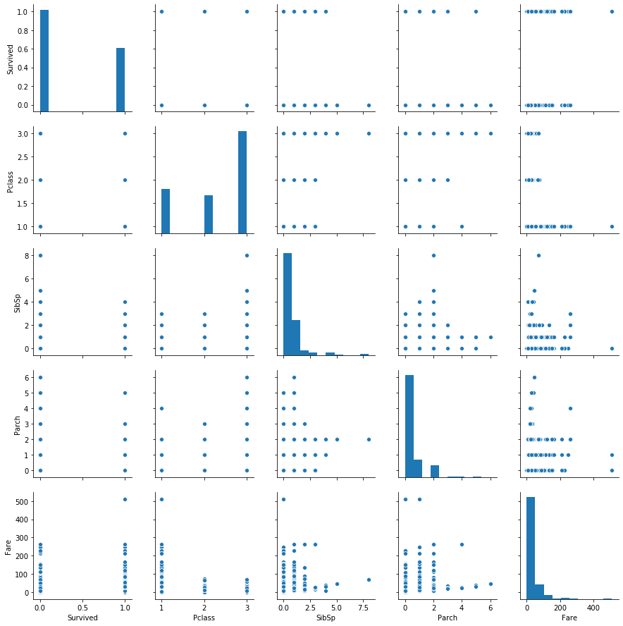
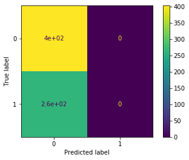
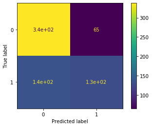
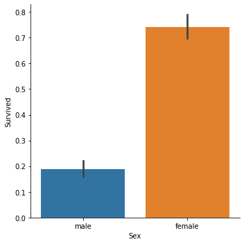
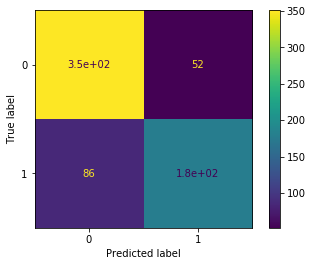

# Modeling Walkthrough


```python
import pandas as pd
import numpy as np

import seaborn as sns

from sklearn.preprocessing import LabelEncoder
from sklearn.preprocessing import StandardScaler

from sklearn.dummy import DummyClassifier
from sklearn.linear_model import LogisticRegression

from sklearn.model_selection import train_test_split
from sklearn.model_selection import cross_val_score

from sklearn.metrics import plot_confusion_matrix
from sklearn.metrics import confusion_matrix
```

## Modeling Steps

1. Build a model based on the [Titanic dataset](https://www.kaggle.com/c/titanic/data) that predicts whether a given person survived or not
2. Evaluate the performance of the model
3. Make changes in an attempt to improve the model
4. Demonstrate whether an improvement was made

## The Data

This dataset has the following columns:

| Variable | Definition | Key |
| -------- | ---------- | --- |
| survival | Survival | 0 = No, 1 = Yes |
| pclass | Ticket class | 1 = 1st, 2 = 2nd, 3 = 3rd |
| sex | Sex | |
| Age | Age in years | |
| sibsp | # of siblings / spouses aboard the Titanic | |
| parch | # of parents / children aboard the Titanic | |
| ticket | Ticket number | |
| fare | Passenger fare | |
| cabin | Cabin number | |
| embarked | Port of Embarkation | C = Cherbourg, Q = Queenstown, S = Southampton |

## Initial Data Understanding and Preparation

Open up the file, get everything into `X` features and `y` target variables, divided into train and test


```python
df = pd.read_csv("titanic.csv")
```


```python
df.head()
```


<div>
<style scoped>
    .dataframe tbody tr th:only-of-type {
        vertical-align: middle;
    }

    .dataframe tbody tr th {
        vertical-align: top;
    }

    .dataframe thead th {
        text-align: right;
    }
</style>
<table border="1" class="dataframe">
  <thead>
    <tr style="text-align: right;">
      <th></th>
      <th>PassengerId</th>
      <th>Survived</th>
      <th>Pclass</th>
      <th>Name</th>
      <th>Sex</th>
      <th>Age</th>
      <th>SibSp</th>
      <th>Parch</th>
      <th>Ticket</th>
      <th>Fare</th>
      <th>Cabin</th>
      <th>Embarked</th>
    </tr>
  </thead>
  <tbody>
    <tr>
      <th>0</th>
      <td>1</td>
      <td>0</td>
      <td>3</td>
      <td>Braund, Mr. Owen Harris</td>
      <td>male</td>
      <td>22.0</td>
      <td>1</td>
      <td>0</td>
      <td>A/5 21171</td>
      <td>7.2500</td>
      <td>NaN</td>
      <td>S</td>
    </tr>
    <tr>
      <th>1</th>
      <td>2</td>
      <td>1</td>
      <td>1</td>
      <td>Cumings, Mrs. John Bradley (Florence Briggs Th...</td>
      <td>female</td>
      <td>38.0</td>
      <td>1</td>
      <td>0</td>
      <td>PC 17599</td>
      <td>71.2833</td>
      <td>C85</td>
      <td>C</td>
    </tr>
    <tr>
      <th>2</th>
      <td>3</td>
      <td>1</td>
      <td>3</td>
      <td>Heikkinen, Miss. Laina</td>
      <td>female</td>
      <td>26.0</td>
      <td>0</td>
      <td>0</td>
      <td>STON/O2. 3101282</td>
      <td>7.9250</td>
      <td>NaN</td>
      <td>S</td>
    </tr>
    <tr>
      <th>3</th>
      <td>4</td>
      <td>1</td>
      <td>1</td>
      <td>Futrelle, Mrs. Jacques Heath (Lily May Peel)</td>
      <td>female</td>
      <td>35.0</td>
      <td>1</td>
      <td>0</td>
      <td>113803</td>
      <td>53.1000</td>
      <td>C123</td>
      <td>S</td>
    </tr>
    <tr>
      <th>4</th>
      <td>5</td>
      <td>0</td>
      <td>3</td>
      <td>Allen, Mr. William Henry</td>
      <td>male</td>
      <td>35.0</td>
      <td>0</td>
      <td>0</td>
      <td>373450</td>
      <td>8.0500</td>
      <td>NaN</td>
      <td>S</td>
    </tr>
  </tbody>
</table>
</div>


```python
df.describe()
```


<div>
<style scoped>
    .dataframe tbody tr th:only-of-type {
        vertical-align: middle;
    }

    .dataframe tbody tr th {
        vertical-align: top;
    }

    .dataframe thead th {
        text-align: right;
    }
</style>
<table border="1" class="dataframe">
  <thead>
    <tr style="text-align: right;">
      <th></th>
      <th>PassengerId</th>
      <th>Survived</th>
      <th>Pclass</th>
      <th>Age</th>
      <th>SibSp</th>
      <th>Parch</th>
      <th>Fare</th>
    </tr>
  </thead>
  <tbody>
    <tr>
      <th>count</th>
      <td>891.000000</td>
      <td>891.000000</td>
      <td>891.000000</td>
      <td>714.000000</td>
      <td>891.000000</td>
      <td>891.000000</td>
      <td>891.000000</td>
    </tr>
    <tr>
      <th>mean</th>
      <td>446.000000</td>
      <td>0.383838</td>
      <td>2.308642</td>
      <td>29.699118</td>
      <td>0.523008</td>
      <td>0.381594</td>
      <td>32.204208</td>
    </tr>
    <tr>
      <th>std</th>
      <td>257.353842</td>
      <td>0.486592</td>
      <td>0.836071</td>
      <td>14.526497</td>
      <td>1.102743</td>
      <td>0.806057</td>
      <td>49.693429</td>
    </tr>
    <tr>
      <th>min</th>
      <td>1.000000</td>
      <td>0.000000</td>
      <td>1.000000</td>
      <td>0.420000</td>
      <td>0.000000</td>
      <td>0.000000</td>
      <td>0.000000</td>
    </tr>
    <tr>
      <th>25%</th>
      <td>223.500000</td>
      <td>0.000000</td>
      <td>2.000000</td>
      <td>20.125000</td>
      <td>0.000000</td>
      <td>0.000000</td>
      <td>7.910400</td>
    </tr>
    <tr>
      <th>50%</th>
      <td>446.000000</td>
      <td>0.000000</td>
      <td>3.000000</td>
      <td>28.000000</td>
      <td>0.000000</td>
      <td>0.000000</td>
      <td>14.454200</td>
    </tr>
    <tr>
      <th>75%</th>
      <td>668.500000</td>
      <td>1.000000</td>
      <td>3.000000</td>
      <td>38.000000</td>
      <td>1.000000</td>
      <td>0.000000</td>
      <td>31.000000</td>
    </tr>
    <tr>
      <th>max</th>
      <td>891.000000</td>
      <td>1.000000</td>
      <td>3.000000</td>
      <td>80.000000</td>
      <td>8.000000</td>
      <td>6.000000</td>
      <td>512.329200</td>
    </tr>
  </tbody>
</table>
</div>


Age data is missing for about 1 in 9 rows in our dataset.  For now, let's just exclude it, plus the non-numeric columns, and `PassengerId` which doesn't seem like a real feature, but rather just an artifact of the dataset.


```python
columns_to_use = ["Survived", "Pclass", "SibSp", "Parch", "Fare"]
```


```python
df["Survived"].value_counts()
```


    0    549
    1    342
    Name: Survived, dtype: int64


Not a huge class imbalance, but not evenly-sized categories either


```python
sns.pairplot(df[columns_to_use])
```


    <seaborn.axisgrid.PairGrid at 0x11638bac8>





```python
df_to_use = df[columns_to_use]
X = df_to_use.drop("Survived", axis=1)
y = df_to_use["Survived"]
X_train, X_test, y_train, y_test = train_test_split(X, y, random_state=2019)
```

## Modeling

Let's start with a completely "dummy" model, that will always choose the majority class.


```python
dummy_model = DummyClassifier(strategy="most_frequent")
```

Fit the model on our data


```python
dummy_model.fit(X_train, y_train)
```


    DummyClassifier(constant=None, random_state=None, strategy='most_frequent')


We should expect all predictions to be the same


```python
# just grabbing the first 50 to save space
dummy_model.predict(X_train)[:50]
```


    array([0, 0, 0, 0, 0, 0, 0, 0, 0, 0, 0, 0, 0, 0, 0, 0, 0, 0, 0, 0, 0, 0,
           0, 0, 0, 0, 0, 0, 0, 0, 0, 0, 0, 0, 0, 0, 0, 0, 0, 0, 0, 0, 0, 0,
           0, 0, 0, 0, 0, 0])


## Model Evaluation


```python
dummy_model.score(X_train, y_train)
```


    0.6032934131736527


So, the mean accuracy is about 60% if we always guess the majority class


```python
plot_confusion_matrix(dummy_model, X_train, y_train)
```


    <sklearn.metrics._plot.confusion_matrix.ConfusionMatrixDisplay at 0x11d125080>





A pretty lopsided confusion matrix!

## Modeling, Again

Let's use a logistic regression and compare its performance


```python
logreg_model = LogisticRegression(random_state=2019)
```


```python
logreg_model.fit(X_train, y_train)
```


    LogisticRegression(C=1.0, class_weight=None, dual=False, fit_intercept=True,
                       intercept_scaling=1, l1_ratio=None, max_iter=100,
                       multi_class='auto', n_jobs=None, penalty='l2',
                       random_state=2019, solver='lbfgs', tol=0.0001, verbose=0,
                       warm_start=False)


Look at the predictions


```python
logreg_model.predict(X_train)[:50]
```


    array([1, 0, 0, 0, 0, 0, 0, 0, 1, 1, 0, 1, 0, 1, 0, 0, 0, 0, 0, 1, 0, 1,
           0, 1, 0, 0, 0, 0, 1, 0, 1, 1, 0, 0, 0, 1, 0, 0, 0, 0, 1, 0, 0, 0,
           0, 0, 0, 0, 0, 0])


Mixture of 1s and 0s this time

## Model Evaluation, Again


```python
logreg_model.score(X_train, y_train)
```


    0.7005988023952096


So the mean accuracy is 70% if the model is actually taking in information from the features instead of always guessing the majority class


```python
plot_confusion_matrix(logreg_model, X_train, y_train)
```


    <sklearn.metrics._plot.confusion_matrix.ConfusionMatrixDisplay at 0x11d545e80>





```python
confusion_matrix(y_train, logreg_model.predict(X_train))
```


    array([[338,  65],
           [135, 130]])


So, in general we are not labeling many of the "not survived" passengers as "survived", but for "survived" passengers we're getting it right only about half of the time

## Data Understanding and Preparation, Again

Maybe there is some useful information in the features we are not using yet.


```python
df.columns
```


    Index(['PassengerId', 'Survived', 'Pclass', 'Name', 'Sex', 'Age', 'SibSp',
           'Parch', 'Ticket', 'Fare', 'Cabin', 'Embarked'],
          dtype='object')


```python
df["Name"]
```


    0                                Braund, Mr. Owen Harris
    1      Cumings, Mrs. John Bradley (Florence Briggs Th...
    2                                 Heikkinen, Miss. Laina
    3           Futrelle, Mrs. Jacques Heath (Lily May Peel)
    4                               Allen, Mr. William Henry
                                 ...                        
    886                                Montvila, Rev. Juozas
    887                         Graham, Miss. Margaret Edith
    888             Johnston, Miss. Catherine Helen "Carrie"
    889                                Behr, Mr. Karl Howell
    890                                  Dooley, Mr. Patrick
    Name: Name, Length: 891, dtype: object


Maybe we could do some parsing to make more sense of this, but that seems complicated


```python
df["Sex"]
```


    0        male
    1      female
    2      female
    3      female
    4        male
            ...  
    886      male
    887    female
    888    female
    889      male
    890      male
    Name: Sex, Length: 891, dtype: object


This one is of type "object" but looks potentially one-hot-encode-able


```python
df["Sex"].value_counts()
```


    male      577
    female    314
    Name: Sex, dtype: int64


```python
sns.catplot(x="Sex", y="Survived", data=df, kind="bar")
```


    <seaborn.axisgrid.FacetGrid at 0x11d1259e8>





Looks like there is a meaningful difference in survival rates, so let's add it to the model

Only two categories, so we only need a LabelEncoder (no new columns needed, we just need to replace the strings with numbers)


```python
# re-do the train test split to add another feature
columns_to_use.append("Sex")
df_to_use = df[columns_to_use]
X = df_to_use.drop("Survived", axis=1)
y = df_to_use["Survived"]
X_train, X_test, y_train, y_test = train_test_split(X, y, random_state=2019)
```


```python
label_encoder = LabelEncoder()
```


```python
sex_labels = label_encoder.fit_transform(X_train["Sex"])
sex_labels[:50]
```


    array([0, 1, 1, 1, 1, 0, 1, 1, 1, 1, 1, 1, 0, 1, 1, 1, 1, 1, 1, 1, 1, 0,
           0, 0, 1, 0, 1, 1, 1, 0, 1, 0, 0, 1, 1, 0, 1, 1, 1, 1, 1, 1, 1, 1,
           0, 1, 1, 1, 0, 0])


```python
label_encoder.classes_
```


    array(['female', 'male'], dtype=object)


So, this is telling us that "female" is encoded as 0, "male" is encoded as 1


```python
X_train["sex_encoded"] = sex_labels
X_train = X_train.drop("Sex", axis=1)
```

    /Users/ehoffman/.conda/envs/prework-labs/lib/python3.7/site-packages/ipykernel_launcher.py:1: SettingWithCopyWarning: 
    A value is trying to be set on a copy of a slice from a DataFrame.
    Try using .loc[row_indexer,col_indexer] = value instead
    
    See the caveats in the documentation: http://pandas.pydata.org/pandas-docs/stable/user_guide/indexing.html#returning-a-view-versus-a-copy
      """Entry point for launching an IPython kernel.


## Modeling and Model Evaluation, Again

Let's see how the logistic regression does, now that this new feature has been added


```python
second_logreg_model = LogisticRegression(random_state=2019)
```


```python
second_logreg_model.fit(X_train, y_train)
```


    LogisticRegression(C=1.0, class_weight=None, dual=False, fit_intercept=True,
                       intercept_scaling=1, l1_ratio=None, max_iter=100,
                       multi_class='auto', n_jobs=None, penalty='l2',
                       random_state=2019, solver='lbfgs', tol=0.0001, verbose=0,
                       warm_start=False)


```python
second_logreg_model.score(X_train, y_train)
```


    0.7934131736526946


```python
plot_confusion_matrix(second_logreg_model, X_train, y_train)
```


    <sklearn.metrics._plot.confusion_matrix.ConfusionMatrixDisplay at 0x10758df98>





```python
confusion_matrix(y_train, second_logreg_model.predict(X_train))
```


    array([[351,  52],
           [ 86, 179]])


So, we have improved the mean accuracy from about 70% to 79%, and actually are doing a better job guessing both the "survived" and "not survived" classes

## Data Understanding and Preparation, Part 3

Anything else we want to do with our dataset?


```python
X_train.describe()
```


<div>
<style scoped>
    .dataframe tbody tr th:only-of-type {
        vertical-align: middle;
    }

    .dataframe tbody tr th {
        vertical-align: top;
    }

    .dataframe thead th {
        text-align: right;
    }
</style>
<table border="1" class="dataframe">
  <thead>
    <tr style="text-align: right;">
      <th></th>
      <th>Pclass</th>
      <th>SibSp</th>
      <th>Parch</th>
      <th>Fare</th>
      <th>sex_encoded</th>
    </tr>
  </thead>
  <tbody>
    <tr>
      <th>count</th>
      <td>668.000000</td>
      <td>668.000000</td>
      <td>668.000000</td>
      <td>668.000000</td>
      <td>668.000000</td>
    </tr>
    <tr>
      <th>mean</th>
      <td>2.300898</td>
      <td>0.541916</td>
      <td>0.384731</td>
      <td>32.613341</td>
      <td>0.646707</td>
    </tr>
    <tr>
      <th>std</th>
      <td>0.839897</td>
      <td>1.149817</td>
      <td>0.786052</td>
      <td>51.769425</td>
      <td>0.478351</td>
    </tr>
    <tr>
      <th>min</th>
      <td>1.000000</td>
      <td>0.000000</td>
      <td>0.000000</td>
      <td>0.000000</td>
      <td>0.000000</td>
    </tr>
    <tr>
      <th>25%</th>
      <td>2.000000</td>
      <td>0.000000</td>
      <td>0.000000</td>
      <td>7.917700</td>
      <td>0.000000</td>
    </tr>
    <tr>
      <th>50%</th>
      <td>3.000000</td>
      <td>0.000000</td>
      <td>0.000000</td>
      <td>14.500000</td>
      <td>1.000000</td>
    </tr>
    <tr>
      <th>75%</th>
      <td>3.000000</td>
      <td>1.000000</td>
      <td>0.000000</td>
      <td>31.275000</td>
      <td>1.000000</td>
    </tr>
    <tr>
      <th>max</th>
      <td>3.000000</td>
      <td>8.000000</td>
      <td>5.000000</td>
      <td>512.329200</td>
      <td>1.000000</td>
    </tr>
  </tbody>
</table>
</div>


Looks like Fare is a much bigger number than the others.  Maybe we apply a standard scaler so everything has the same scale


```python
scaler = StandardScaler()
scaler.fit_transform(X_train)
```


    array([[-1.55003944,  0.3986958 , -0.48981356,  0.74752493, -1.35296285],
           [ 0.83299013, -0.47165974, -0.48981356, -0.48063064,  0.73911859],
           [-0.35852466, -0.47165974, -0.48981356, -0.42747068,  0.73911859],
           ...,
           [ 0.83299013,  6.49118455,  2.05645461,  0.71401869,  0.73911859],
           [-1.55003944,  0.3986958 , -0.48981356,  0.44129262,  0.73911859],
           [-0.35852466, -0.47165974, -0.48981356,  0.79037573,  0.73911859]])


```python
X_train = pd.DataFrame(scaler.fit_transform(X_train), columns=['Pclass', 'SibSp', 'Parch', 'Fare', 'sex_encoded'])
```


```python
X_train.head()
```


<div>
<style scoped>
    .dataframe tbody tr th:only-of-type {
        vertical-align: middle;
    }

    .dataframe tbody tr th {
        vertical-align: top;
    }

    .dataframe thead th {
        text-align: right;
    }
</style>
<table border="1" class="dataframe">
  <thead>
    <tr style="text-align: right;">
      <th></th>
      <th>Pclass</th>
      <th>SibSp</th>
      <th>Parch</th>
      <th>Fare</th>
      <th>sex_encoded</th>
    </tr>
  </thead>
  <tbody>
    <tr>
      <th>0</th>
      <td>-1.550039</td>
      <td>0.398696</td>
      <td>-0.489814</td>
      <td>0.747525</td>
      <td>-1.352963</td>
    </tr>
    <tr>
      <th>1</th>
      <td>0.832990</td>
      <td>-0.471660</td>
      <td>-0.489814</td>
      <td>-0.480631</td>
      <td>0.739119</td>
    </tr>
    <tr>
      <th>2</th>
      <td>-0.358525</td>
      <td>-0.471660</td>
      <td>-0.489814</td>
      <td>-0.427471</td>
      <td>0.739119</td>
    </tr>
    <tr>
      <th>3</th>
      <td>0.832990</td>
      <td>-0.471660</td>
      <td>-0.489814</td>
      <td>-0.467422</td>
      <td>0.739119</td>
    </tr>
    <tr>
      <th>4</th>
      <td>0.832990</td>
      <td>-0.471660</td>
      <td>-0.489814</td>
      <td>-0.477248</td>
      <td>0.739119</td>
    </tr>
  </tbody>
</table>
</div>


```python
third_logreg_model = LogisticRegression(random_state=2019)
third_logreg_model.fit(X_train, y_train)
third_logreg_model.score(X_train, y_train)
```


    0.7934131736526946


Didn't break anything, didn't fix anything

## Cross Validation

Let's make sure we are not just overfitting to the training data


```python
# make a fourth model that is the same as the third one, just not fitted yet
fourth_logreg_model = LogisticRegression(random_state=2019)
cross_val_score(fourth_logreg_model, X_train, y_train)
```


    array([0.80597015, 0.79850746, 0.74626866, 0.78947368, 0.81203008])


So, depending on the way the data is sliced, we have somewhere between 74.6% and 81.2% mean accuracy

## Hyperparameter Tuning

Logistic regression has a number of hyperparameters, let's look at the documentation: https://scikit-learn.org/stable/modules/generated/sklearn.linear_model.LogisticRegression.html

It says that the 'liblinear' solver is not the default, but it is good for small datasets (our data is fewer than 1k rows, which is "small"), so let's try that


```python
fifth_logreg_model = LogisticRegression(random_state=2019, solver='liblinear')
cross_val_score(fifth_logreg_model, X_train, y_train)
```


    array([0.79850746, 0.79850746, 0.74626866, 0.78947368, 0.81203008])


Slightly worse

Let's try a different penalty


```python
sixth_logreg_model = LogisticRegression(random_state=2019, penalty='none')
cross_val_score(sixth_logreg_model, X_train, y_train)
```


    array([0.79850746, 0.79850746, 0.74626866, 0.78947368, 0.81203008])


Doesn't seem to make a big difference.  Doesn't seem like hyperparameter tuning matters much

## Final Evaluation

Now let's use the test data we haven't used at all yet


```python
# read fresh copy from CSV
final_df = pd.read_csv("titanic.csv")

# preprocessing
columns_to_use = ["Survived", "Pclass", "SibSp", "Parch", "Fare", "Sex"]
df_to_use = final_df[columns_to_use]
X = df_to_use.drop("Survived", axis=1)
y = df_to_use["Survived"]
X_train, X_test, y_train, y_test = train_test_split(X, y, random_state=2019)
```


```python
label_encoder = LabelEncoder()

X_train["sex_encoded"] = label_encoder.fit_transform(X_train["Sex"])
X_train = X_train.drop("Sex", axis=1)

X_test["sex_encoded"] = label_encoder.transform(X_test["Sex"])
X_test = X_test.drop("Sex", axis=1)

scaler = StandardScaler()

X_train = pd.DataFrame(scaler.fit_transform(X_train), columns=['Pclass', 'SibSp', 'Parch', 'Fare', 'sex_encoded'])
X_test = pd.DataFrame(scaler.transform(X_test), columns=['Pclass', 'SibSp', 'Parch', 'Fare', 'sex_encoded'])

```

    /Users/ehoffman/.conda/envs/prework-labs/lib/python3.7/site-packages/ipykernel_launcher.py:3: SettingWithCopyWarning: 
    A value is trying to be set on a copy of a slice from a DataFrame.
    Try using .loc[row_indexer,col_indexer] = value instead
    
    See the caveats in the documentation: http://pandas.pydata.org/pandas-docs/stable/user_guide/indexing.html#returning-a-view-versus-a-copy
      This is separate from the ipykernel package so we can avoid doing imports until
    /Users/ehoffman/.conda/envs/prework-labs/lib/python3.7/site-packages/ipykernel_launcher.py:6: SettingWithCopyWarning: 
    A value is trying to be set on a copy of a slice from a DataFrame.
    Try using .loc[row_indexer,col_indexer] = value instead
    
    See the caveats in the documentation: http://pandas.pydata.org/pandas-docs/stable/user_guide/indexing.html#returning-a-view-versus-a-copy
      


```python
final_model = LogisticRegression(random_state=2019)
final_model.fit(X_train, y_train)
```


    LogisticRegression(C=1.0, class_weight=None, dual=False, fit_intercept=True,
                       intercept_scaling=1, l1_ratio=None, max_iter=100,
                       multi_class='auto', n_jobs=None, penalty='l2',
                       random_state=2019, solver='lbfgs', tol=0.0001, verbose=0,
                       warm_start=False)


```python
final_model.score(X_test, y_test)
```


    0.8026905829596412


```python

```
